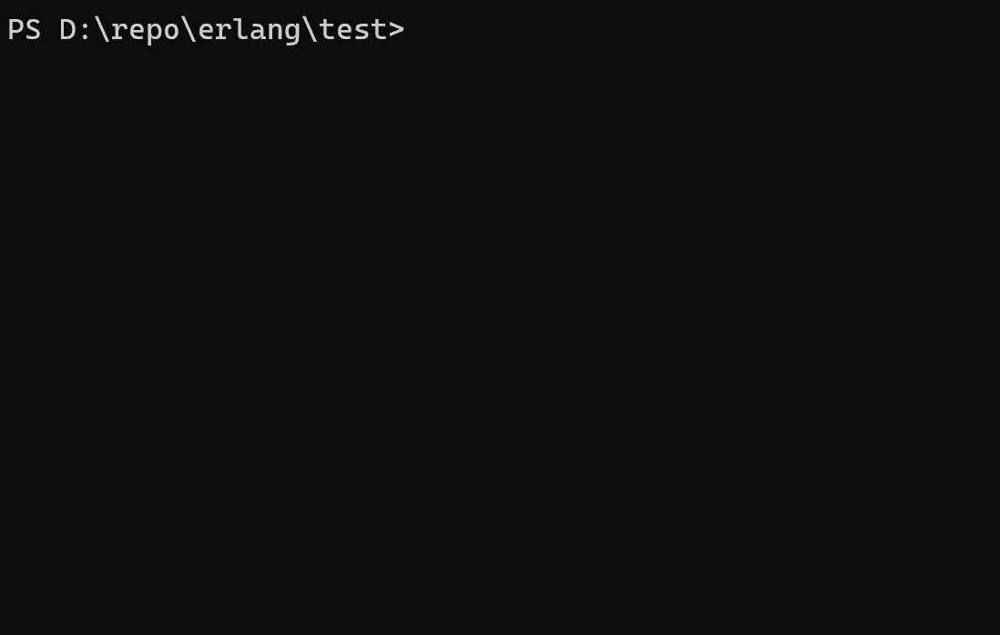
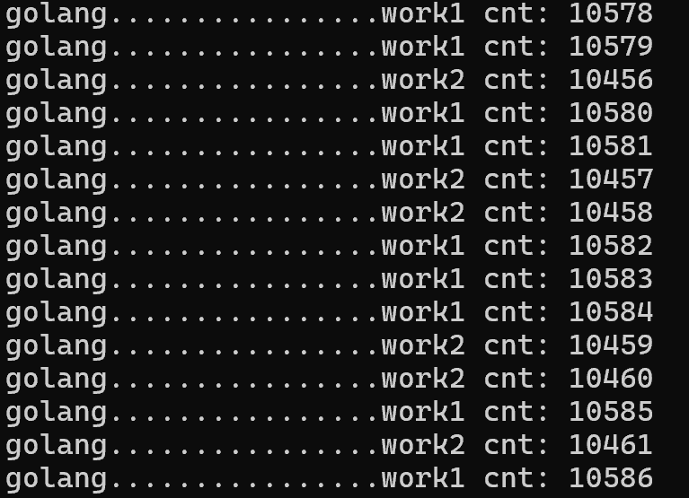
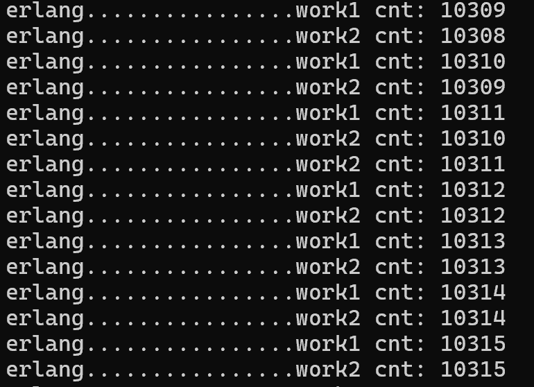

# Scheduler Fairness and Real-Time Performance: Golang vs Erlang

## Overview

This repository contains a comparative analysis of the scheduling fairness and real-time performance between Golang and Erlang. The tests demonstrate that **Golang's goroutine scheduler performs poorly** - it's crude, unfair, and lacks good real-time characteristics. In contrast, Erlang's scheduler proves significantly superior in both fairness and real-time performance!

## Experimental Conclusions

Based on our rigorous testing:

- **Golang's scheduler** exhibits 粗糙 (crude) implementation, demonstrating clear unfairness and poor real-time performance
- **Erlang's scheduler** outperforms Golang dramatically, showing excellent fairness and real-time characteristics

## Test Methodology

### The Core Principle
The essence of scheduler evaluation lies in testing whether concurrent processes/goroutines receive fair treatment even when some routines are consuming substantial CPU resources. Other routines should enjoy equal execution opportunities rather than being forced into delay or blocking.

### Implementation Approach
We designed two identical functions (`work1` and `work2`) in both languages, then launched multiple resource-intensive routines (`work_busy`) to compete for system resources.  

### Accounting for Performance Differences
While Golang (as a static language) naturally delivers higher performance, we adjusted the number of `work_busy` routines appropriately for each language to ensure:
- Both implementations maintain similar execution rates (approximately 60-80 executions per second)
- `work1` and `work2` achieve roughly the same execution counts within the same timeframe
- The comparison focuses specifically on scheduler behavior rather than raw language performance

### Test Environment and Versions
The tests were conducted using the following runtime versions:
- Erlang/OTP: Version 27 [erts-15.0.1] [64-bit] [smp:16:16]
- Golang: version go1.25.0 windows/amd64

### Platform Hardware & OS Environment:
- Device: LAPTOP-H670TST5
- Processor: 13th Gen Intel(R) Core(TM) i5-1340P (1.90 GHz)
- Memory: 16.0 GB RAM
- OS: Windows 11 Home Chinese Edition (24H2)
- OS Version: 26100.4946
- Architecture: 64-bit operating system, x64-based processor

  
Start to run golang:

   
Start to run Erlang:

## Results Analysis

After running approximately 10,000 iterations:

- **Golang results**: `work1` and `work2` showed a difference of **over 100 executions**
- **Erlang results**: `work1` and `work2` differed by only **1 execution** - an astonishing result!

Result of golang:  

   
Result of erlang:  

## Key Insights

Erlang's scheduler demonstrates true soft real-time capabilities and implements genuinely fair preemptive scheduling - areas where Golang clearly falls short. The longer Golang runs under CPU-intensive conditions, the greater the disparity between `work1` and `work2` becomes.

## Conclusion

This comparison reveals fundamental differences in scheduler design philosophy. Erlang's battle-tested process scheduler, designed for telecommunications-grade reliability, demonstrates superior fairness and real-time characteristics compared to Golang's more recent goroutine scheduler, particularly under sustained CPU pressure.
